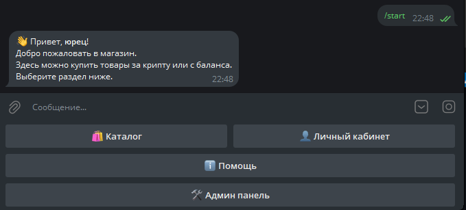
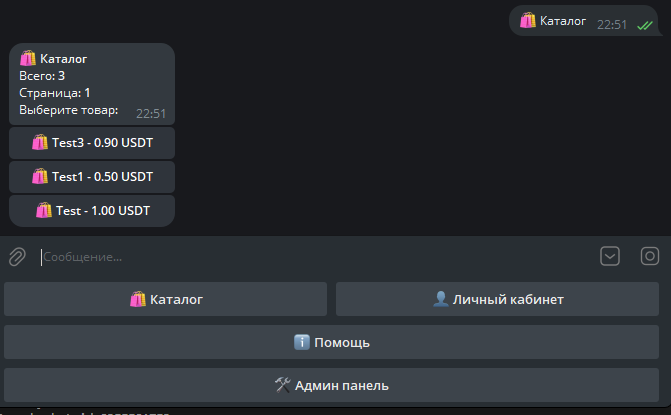
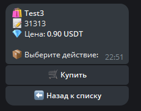
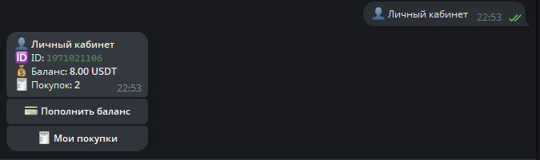
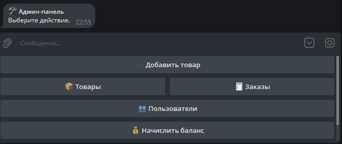

# AIO Sell Bot


Готовый Telegram-магазин на `aiogram 3` с оплатой через **Crypto Pay API** и оплатой с внутреннего баланса.

## Что внутри
- Каталог товаров и карточки товаров.
- Покупка в пару кликов (Crypto Pay или баланс).
- Пополнение баланса с фиксированными и кастомными суммами.
- Личный кабинет и история покупок.
- Админ-панель: товары, заказы, пользователи, баланс.
- SQLite с автоматической инициализацией схемы.

## Быстрый старт
```bash
python -m venv .venv
source .venv/bin/activate
pip install -r requirements.txt
cp .env.example .env
```

Заполните `.env` и запустите:
```bash
python -m main
```

> Если запускаете из другого каталога как пакет, используйте модульный запуск с корректным `PYTHONPATH`.

## Переменные окружения
| Переменная | Обязательная | Описание |
|---|---:|---|
| `BOT_TOKEN` | ✅ | Токен Telegram-бота от `@BotFather` |
| `CRYPTO_BOT_TOKEN` | ✅ | Токен Crypto Pay API |
| `CRYPTO_BOT_API_URL` | ⛔ | URL API (по умолчанию `https://pay.crypt.bot/api`) |
| `CRYPTO_ASSET` | ⛔ | Валюта оплат (`USDT`, `TON`, `BTC`...) |
| `ADMIN_IDS` | ⛔ | Список Telegram ID админов через запятую |
| `DB_PATH` | ⛔ | Путь к SQLite-файлу |

## Структура проекта
```text
.
├── handlers/            # Пользовательские, админские и общие хендлеры
├── keyboards/           # Inline / Reply клавиатуры
├── utils/               # Форматирование текста и callback-data
├── config.py            # Загрузка конфигурации
├── crypto_pay.py        # Клиент Crypto Pay API
├── db.py                # Работа с SQLite
├── middlewares.py       # DI middleware для db/config/crypto
├── main.py              # Точка входа
├── .env.example
└── tests/
```

## Тестирование
```bash
pip install -r requirements-dev.txt
pytest
```

## Релизы
См. `CHANGELOG.md` и `RELEASE.md`.

## Скриншоты





